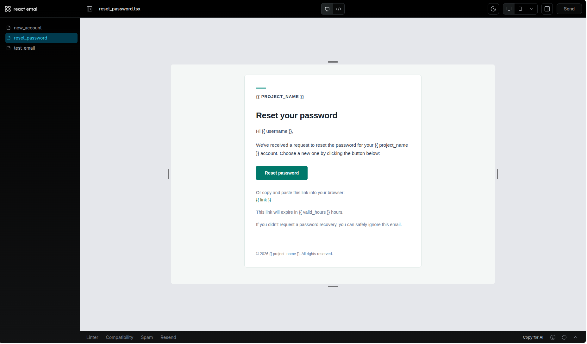

# ApplyTrack

ApplyTrack is a full-stack job-application workspace. It helps candidates track opportunities, keep follow-up notes, and use optional AI assistance to compare their real experience with a job description.

## ApplyTrack features

- Secure account registration and JWT-based sign-in
- Application tracker with editable company/role records and pipeline notes
- Responsive React dashboard and dark mode
- PostgreSQL persistence with a FastAPI REST API
- AI Application Copilot: private, on-demand resume-to-job-description comparison that highlights genuine strengths, gaps, and a next step
- AI is deliberately optional: the feature works only after setting `OPENAI_API_KEY` in a local `.env`; keys and submitted text are never committed or stored by ApplyTrack
- Auto-generated API documentation at `/docs`

## Run locally

1. Install Docker Desktop.
2. Copy the provided `.env` values and replace development secrets before any public deployment.
3. From the repository root, run `docker compose up --build`.
4. Open the frontend at `http://localhost:5173` and API docs at `http://localhost:8000/docs`.

For the optional AI Copilot, add these local-only values to `.env`:

```text
OPENAI_API_KEY=your_key_here
OPENAI_MODEL=gpt-4.1-mini
```

## Attribution

ApplyTrack is built on the [FastAPI Full Stack Template](https://github.com/fastapi/full-stack-fastapi-template), licensed under MIT. This project preserves the template's license and adds the ApplyTrack branding, application-focused workflow, and AI Copilot integration.

---

# Full Stack FastAPI Template

[](../../actions/workflows/test-docker-compose.yml)
[](../../actions/workflows/test-backend.yml)

## Technology Stack and Features

- ⚡ [**FastAPI**](https://fastapi.tiangolo.com) for the Python backend API.
  - 🧰 [SQLModel](https://sqlmodel.tiangolo.com) for the Python SQL database interactions (ORM).
  - 🔍 [Pydantic](https://docs.pydantic.dev), used by FastAPI, for the data validation and settings management.
  - 💾 [PostgreSQL](https://www.postgresql.org) as the SQL database.
- 🚀 [React](https://react.dev) for the frontend.
  - 🧩 Built into the backend application and served by FastAPI on the same domain as the API.
  - 💃 Using TypeScript, hooks, [Vite](https://vitejs.dev), and other parts of a modern frontend stack.
  - 🎨 [Tailwind CSS](https://tailwindcss.com) and [shadcn/ui](https://ui.shadcn.com) for the frontend components.
  - 🤖 An automatically generated frontend client.
  - 🧪 [Playwright](https://playwright.dev) for end-to-end testing.
  - 🦇 Dark mode support.
- ☁️ [FastAPI Cloud](https://fastapicloud.com) for deployment.
- 🐋 [Docker Compose](https://www.docker.com) for local services and self-hosted deployment.
  - 📞 [Traefik](https://traefik.io) as a reverse proxy with automatic HTTPS.
- 🔒 Secure password hashing by default.
- 🔑 JWT (JSON Web Token) authentication.
- 📫 Email-based password recovery.
- ✉️ [React Email](https://react.email) for email templates.
- 📬 [Mailpit](https://mailpit.axllent.org) for local email testing during development.
- ✅ Tests with [Pytest](https://pytest.org).
- 🏭 CI (continuous integration) and CD (continuous deployment) based on GitHub Actions.

### Dashboard Login


### Dashboard - Admin


### Dashboard - Items


### Dashboard - Dark Mode


### React Email Templates



### Mailpit - Local Email Testing


### Interactive API Documentation


## How to Use It

Click the **Use this template** button at the top of this page to create a new repository.

## Backend Development

Backend docs: [backend/README.md](./backend/README.md).

## Frontend Development

Frontend docs: [frontend/README.md](./frontend/README.md).

## Deployment

FastAPI Cloud deployment: [deployment.md](./deployment.md).

Self-hosted deployment with Docker Compose: [deployment-docker-compose.md](./deployment-docker-compose.md).

## Development

General development docs: [development.md](./development.md).

This includes the local FastAPI and Vite workflow, Docker Compose services, `.env` configuration, and more.

## Release Notes

Check the file [release-notes.md](./release-notes.md).

## License

The Full Stack FastAPI Template is licensed under the terms of the MIT license.
